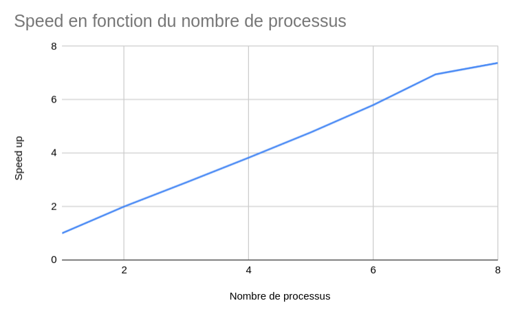

# Machine: lscpu

Voici le résultat de la commande `lscpu`  

Architecture :                              x86_64 
  Mode(s) opératoire(s) des processeurs :   32-bit, 64-bit 
  Address sizes:                            48 bits physical, 48 bits virtual 
  Boutisme :                                Little Endian 
Processeur(s) :                             16 
  Liste de processeur(s) en ligne :         0-15 
Identifiant constructeur :                  AuthenticAMD 
  Nom de modèle :                           AMD Ryzen 7 4800H with Radeon Graphi 
                                            cs
    Famille de processeur :                 23 
    Modèle :                                96 
    Thread(s) par cœur :                    2 
    Cœur(s) par socket :                    8 
    Socket(s) :                             1 

Ainsi ma machine possède 4 coeurs logiques et 8 coeurs logiques 

Voici la quantité de mémoire L2 et L3 de ma machine
Caches (sum of all):                        
  L2:                                       4 MiB (8 instances)
  L3:                                       8 MiB (2 instances)

# Automate cellulaire 1D

Pour calculer le speed up on va prendre le temps total c'est à dire : Temps de calcul + Temps d'affichage

|Nombre de process|Temps totale (s)|Speed up|
|-|-|-|
|1|	8,010815	|1 |
|2|	4,004604	|2,000401288 |
|3|	2,753906	|2,908891952 |
|4|	2,091147	|3,830823467 |
|5|	1,674589	|4,783749923 |
|6|	1,380992	|5,800768578 |
|7|	1,1525759|	6,95035789 |
|8|	1,0855906|	7,379222886 |
		
Voila ce que donne le graphe
 

# Calcul d'une enveloppe convexe

